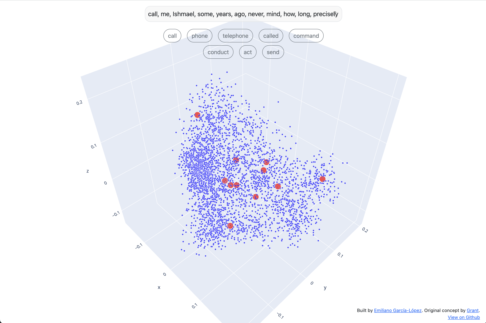

# LatentDictionary

## Overview




LatentDictionary is a unique visualization tool that leverages the power of word embeddings to showcase the semantic relationships of words in an interactive 3D space. By inputting a word, users can explore its closest semantic neighbors. The app fetches word embeddings for the Oxford 3000 list and can dynamically retrieve embeddings for new words using the OpenAI API, ensuring a rich and expanding vocabulary landscape.

## Features

1. **3D Visualization**: See and explore the semantic space of words in three dimensions.
2. **Dynamic Embedding Retrieval**: Introduce a new word, and the app will fetch its embedding and seamlessly incorporate it into the visualization.
3. **Interactivity**: Click on a word in the 3D space to shift the focus and explore its semantic neighbors.

## Setup & Installation

### Prerequisites:

- Python 3
- OpenAI API Key

### Steps:

1. Clone the repository:

   ```bash
   git clone https://github.com/EmilianoGarciaLopez/Latent-Dictionary.git
   cd Latent-Dictionary
   ```

2. Install the required packages:

   ```bash
   pip install -r requirements.txt
   ```

3. Set up the environment variable for OpenAI API:

   ```bash
   echo "OPENAI_KEY=your_openai_api_key" > .env
   ```

4. Run the application:

   ```bash
   python index.py
   ```

5. Open your browser and visit `http://localhost:8050`.

## Usage

1. Enter a word in the search bar.
2. The 3D visualization will display the word's closest semantic neighbors.
3. Click on any word to reorient the visualization around that word.

## Contributing

Pull requests are welcome! For major changes, please open an issue first to discuss what you would like to change.

## License

This project is licensed under the MIT License.

## Credits

- **Emiliano García-López**: Main Developer - [GitHub](https://github.com/EmilianoGarciaLopez)
- **Grant**: Original Concept - [Twitter Post](https://twitter.com/granawkins/status/1715231557974462648)

## Additional Links

- [View on Github](https://github.com/EmilianoGarciaLopez/Latent-Dictionary)

## Feedback

If you have any feedback or run into issues, please file an issue on the GitHub repository.
